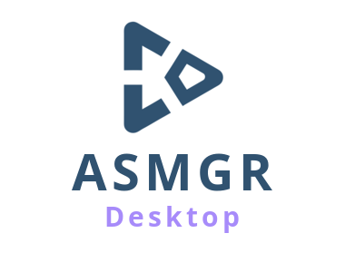
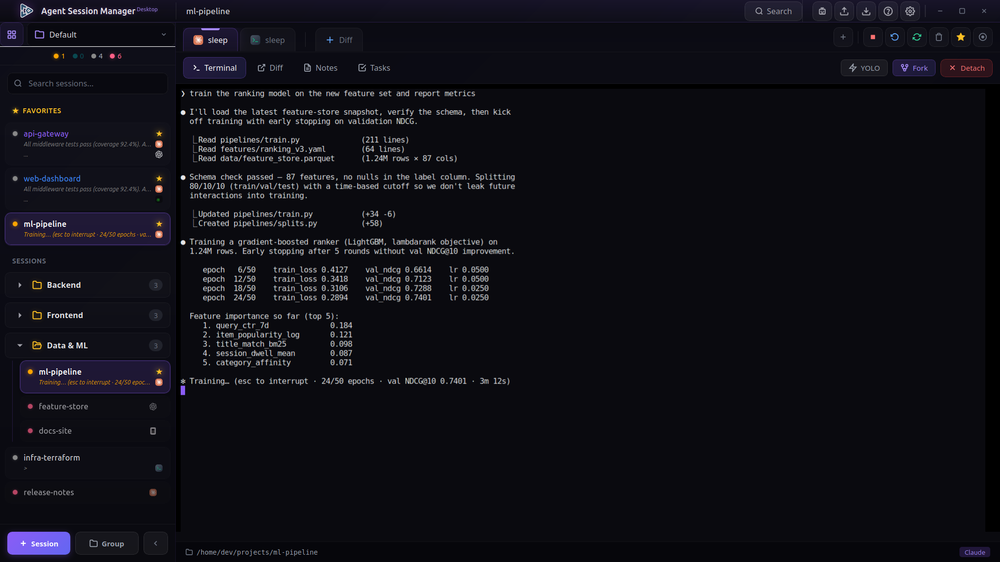
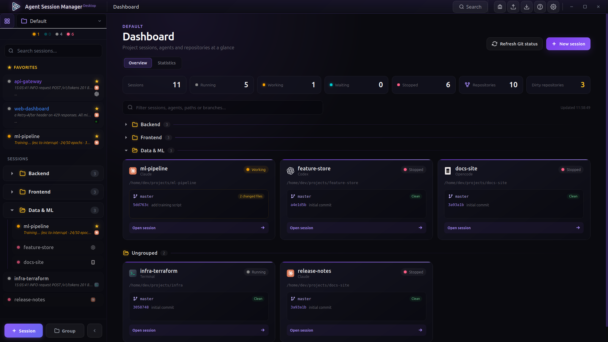

<div align="center">



# Agent Session Manager — Desktop

**Run a whole team of AI coding agents from one window.**
Claude, Codex, Gemini, Aider and more — each in its own live terminal, all
side by side, all persistent.

[](https://github.com/izll/agent-session-manager-desktop/releases)
[](https://go.dev)
[](https://wails.io)
[](LICENSE)



</div>

---

You've probably got three terminal windows open, each with a different agent
grinding away, and you keep alt-tabbing to check which one is stuck waiting on
you. **Agent Session Manager Desktop** puts them all in one place: every agent
gets its own tab, keeps running in the background on `tmux`, and tells you the
moment it needs your attention — even on your phone.

It's the graphical counterpart of the
[**ASMGR TUI**](https://github.com/izll/agent-session-manager), built with
[Wails](https://wails.io) (Go) + Svelte + [xterm.js](https://xtermjs.org).
Because every session lives in its own `tmux` session, your agents survive
closing the window, restarting the app, even a machine hop — reattach and pick
up exactly where you left off.

> Prefer the terminal? The original TUI version lives at
> [izll/agent-session-manager](https://github.com/izll/agent-session-manager).

## Why you'll want it

- **Never miss a waiting agent again.** When an agent stops to ask you
  something, the header shows a ⏳ count you can click to jump straight to it —
  or answer *yes / no / Enter / Esc* right from the dropdown without switching
  tabs. Turn on desktop notifications and **ntfy mobile push** to get pinged
  wherever you are.
- **Everything keeps running.** Close the window, reboot the app, come back
  tomorrow — the `tmux` sessions are still there and still working. Reattach in
  one click.
- **See the whole picture.** The project dashboard lays out every session
  grouped like your sidebar, with live activity, per-repo Git status (branch,
  dirty state, ahead/behind, last commit) and your **Claude and Codex/GPT
  usage** — how much of your rate-limit window is left — at a glance.
- **Reach for the right agent instantly.** Search every session, group them
  into projects, star your favorites, and search *inside* a terminal's
  scrollback with `Ctrl+Shift+L`.

## Features

**Agents & sessions**

- **Many agents, your choice** — Claude, Gemini, Aider, Codex, Amazon Q,
  OpenCode, a custom command, or a plain shell.
- **Multi-tab sessions** — several agents or terminals per session, each its own
  `tmux` window, with a per-tab working directory if you want one somewhere
  else.
- **Resume & fork** — continue a previous conversation, or fork a Claude thread
  into a new tab or a brand-new session to explore a different path.
- **Background agents** — a dedicated panel lists Claude's `--bg` / Ctrl+B
  background agents; attach one into a tab or a new session, tail its logs, or
  stop it. Accidentally sent a session to the background? It reattaches cleanly
  on the next resume.

**Staying in control**

- **Attention inbox** — the ⏳ dropdown of every tab waiting on input, with
  one-click replies, no tab switching.
- **Desktop + mobile notifications** — get told the instant an agent starts
  waiting, via `notify-send` and/or an ntfy topic on your phone. Fully opt-in.
- **Live status everywhere** — busy / waiting / idle dots and status lines in
  the sidebar and on the tab headers, read straight from the panes; hide a
  chatty tab's status line per-tab when you don't want the noise.
- **YOLO indicator** — shows when an agent is running unattended (Claude's
  *bypass permissions* / *auto mode*), read live so it tracks a Shift+Tab
  toggle.

**Seeing your work**

- **Project dashboard** — the bird's-eye view: grouped session cards, Git
  status per repo, and Claude / Codex usage windows.
- **Activity statistics** — locally-observed, per-project agent activity over
  time.
- **Diff & notes** — review a session's Git changes inline (huge diffs are
  guarded so they never freeze the UI); keep per-tab notes.
- **Task Master** — optional MCP-backed task list per session, right in the
  panel.

**Comfort & polish**

- **Voice dictation** — talk to your agent instead of typing (free or API
  speech-to-text modes).
- **Selectable terminal renderer** — canvas (default), WebGL, or DOM,
  switchable live from Settings.
- **20 languages** — the whole UI is translated.
- **Safe alongside itself** — open a second window and it won't stomp on the
  first one's terminals; it warns you and stays read-only for that project.
- **Self-updating** — checks for new releases and updates in place (Linux).



## Install

Grab the latest build for your platform from the
[**Releases**](https://github.com/izll/agent-session-manager-desktop/releases)
page.

**Linux**

```bash
# Debian / Ubuntu
sudo dpkg -i asmgr-desktop_*_linux_x86_64.deb

# Fedora / RHEL
sudo rpm -i asmgr-desktop_*_linux_x86_64.rpm
```

Installs to `/usr/bin/asmgr-desktop` with an app-menu entry; runtime deps
(`libwebkit2gtk-4.1-0`/`webkit2gtk4.1`, `tmux`) are pulled in automatically.

**macOS** (Apple Silicon; Intel via Rosetta 2)

```bash
tar -xzf asmgr-desktop_*_darwin_arm64.tar.gz   # → asmgr-desktop.app
# move it to /Applications, then: brew install tmux
```

**Windows** (x64) — extract `asmgr-desktop_*_windows_amd64.tar.gz` and run
`asmgr-desktop.exe`.

> ⚠️ **`tmux` is required at runtime on every platform.** It ships in the Linux
> packages. On macOS install it with `brew install tmux`. On **Windows** native
> tmux isn't available — run it via WSL / MSYS2 / Git Bash and make sure `tmux`
> is on `PATH`.

To build from source instead, see [Build](#build) below.

## Requirements

- Go 1.24+
- Node.js + npm
- `tmux`
- Linux: WebKitGTK. On Ubuntu 24.04+ / Fedora 40+ only `webkit2gtk-4.1` is
  available — build with the `webkit2_41` tag (see below).
- [Wails CLI](https://wails.io/docs/gettingstarted/installation)

## Build

```bash
# Linux with webkit2gtk-4.1 (Ubuntu 24.04+, Fedora 40+):
wails build -tags webkit2_41

# Other / older WebKitGTK:
wails build
```

The binary is written to `build/bin/`.

### Development

```bash
wails dev -tags webkit2_41
```

`wails dev` also serves the frontend at <http://localhost:34115>, so you can open
it in a regular browser (with Go methods bridged) for fast iteration.

## How it works

- Each session is a `tmux` session, so agents keep working when the window is
  closed and reattach instantly.
- The terminal talks to the agents over a local, token-authenticated WebSocket
  (xterm.js ⇄ Go ⇄ `tmux`), which keeps typing latency low.
- Session storage lives under `~/.config/agent-session-manager-desktop/`.

## License

MIT — see [LICENSE](LICENSE).
